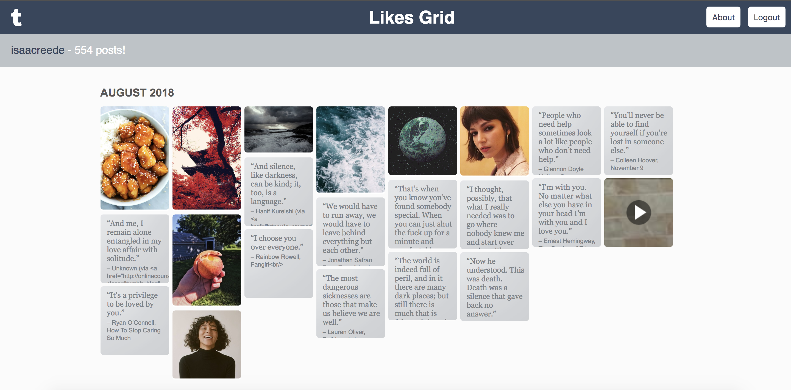

# Likes Grid

This project is an attempt to streamline the display of a user's 'likes' on Tumblr. The grid is based off of the
archive page, and uses REST calls to the Tumblr API to populate the tiles.

Uses:
+ oauth.io for user sign in to Tumblr's API
+ CoffeeScript
+ [mustache.js](https://github.com/janl/mustache.js/) for template rendering

If you have a tumblr account, you can [try the grid out](http://malikdh.com/likes-grid) on
your own likes.

